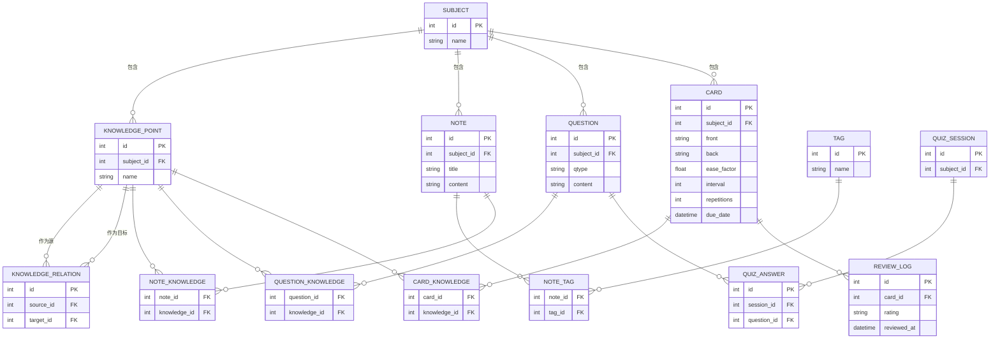

# 02 · 领域数据模型

> 版本：v1.0 ｜ 更新：2024-XX-XX ｜ 作者：学生（AI 协作）
> 上游：01 需求；下游：03 架构、04 接口、05 界面
> 实现：SQLAlchemy 2.0 + SQLite。ID 采用自增主键 `id`（INTEGER）。

---

## 1. 实体总览

| 实体 | 说明 | 对应需求 |
| --- | --- | --- |
| Subject | 学科（预置数学分析、高等代数/线性代数） | RQ-COMMON-01 |
| KnowledgePoint | 知识点 | RQ-KG-01 |
| KnowledgeRelation | 知识点依赖关系（前置依赖） | RQ-KG-02 |
| Note | 笔记（Markdown + LaTeX） | RQ-NOT-* |
| Tag / NoteTag | 标签及笔记标签关联 | RQ-NOT-02 |
| NoteKnowledge | 笔记-知识点多对多 | RQ-NOT-03 |
| Question | 题目 | RQ-QUIZ-01/02 |
| QuestionKnowledge | 题目-知识点多对多 | RQ-QUIZ-03 |
| MathEntry | 数学条目（定理/命题/例题，含编号） | 图片分类归档 |
| QuizSession | 一次刷题会话 | RQ-QUIZ-04 |
| QuizAnswer | 会话中的单题作答记录 | RQ-QUIZ-05/06 |
| Card | 记忆卡片（含间隔重复调度状态） | RQ-SRS-* |
| CardKnowledge | 卡片-知识点多对多 | RQ-SRS-01 |
| ReviewLog | 卡片复习历史 | RQ-SRS-03 |

---

## 2. 表结构定义

### 2.1 Subject（学科）
| 字段 | 类型 | 约束 | 说明 |
| --- | --- | --- | --- |
| id | INTEGER | PK, AI | |
| name | TEXT | NOT NULL, UNIQUE | 学科名 |
| description | TEXT | | 说明 |
| created_at | DATETIME | NOT NULL | |

### 2.2 KnowledgePoint（知识点）
| 字段 | 类型 | 约束 | 说明 |
| --- | --- | --- | --- |
| id | INTEGER | PK, AI | |
| subject_id | INTEGER | FK→Subject, NOT NULL | 所属学科 |
| name | TEXT | NOT NULL | 名称，如"柯西收敛准则" |
| description | TEXT | | 简介（可含 LaTeX） |
| created_at | DATETIME | NOT NULL | |

### 2.3 KnowledgeRelation（知识点依赖）
> 表示 `source` 是 `target` 的前置依赖。
| 字段 | 类型 | 约束 | 说明 |
| --- | --- | --- | --- |
| id | INTEGER | PK, AI | |
| source_id | INTEGER | FK→KnowledgePoint, NOT NULL | 前置点 |
| target_id | INTEGER | FK→KnowledgePoint, NOT NULL | 后置点（依赖前置） |
| UNIQUE(source_id, target_id) | | | 去重 |

### 2.4 Note（笔记）
| 字段 | 类型 | 约束 | 说明 |
| --- | --- | --- | --- |
| id | INTEGER | PK, AI | |
| subject_id | INTEGER | FK→Subject, NOT NULL | 所属学科 |
| title | TEXT | NOT NULL | 标题 |
| content | TEXT | NOT NULL | Markdown 正文（含 LaTeX） |
| created_at | DATETIME | NOT NULL | |
| updated_at | DATETIME | NOT NULL | |

### 2.5 Tag（标签）
| 字段 | 类型 | 约束 | 说明 |
| --- | --- | --- | --- |
| id | INTEGER | PK, AI | |
| name | TEXT | NOT NULL, UNIQUE | 标签名 |

### 2.6 NoteTag（笔记-标签 多对多）
| 字段 | 类型 | 约束 | 说明 |
| --- | --- | --- | --- |
| note_id | INTEGER | FK→Note | |
| tag_id | INTEGER | FK→Tag | |
| PK(note_id, tag_id) | | |

### 2.7 NoteKnowledge（笔记-知识点 多对多）
| 字段 | 类型 | 约束 |
| --- | --- | --- |
| note_id | INTEGER | FK→Note |
| knowledge_id | INTEGER | FK→KnowledgePoint |
| PK(note_id, knowledge_id) | | |

### 2.8 Question（题目）
| 字段 | 类型 | 约束 | 说明 |
| --- | --- | --- | --- |
| id | INTEGER | PK, AI | |
| subject_id | INTEGER | FK→Subject, NOT NULL | |
| qtype | TEXT | NOT NULL | `calculation`(计算)/`proof`(证明) |
| content | TEXT | NOT NULL | 题干（可含公式） |
| options | TEXT | | 兼容旧数据（已不用于作答） |
| answer | TEXT | NOT NULL | 参考答案 |
| explanation | TEXT | | 解析 |
| difficulty | INTEGER | NOT NULL, 默认 3 | 1~5 |
| number | TEXT | | 编号（如 6.2.2，供分章节） |
| chapter | INTEGER | | 章（从编号解析，可空=未分章） |
| section | INTEGER | | 节（从编号解析，可空） |
| core_idea | TEXT | | 核心思路（图片提取/人工填写） |
| steps | TEXT | | 简明操作步骤（JSON 数组字符串，有序） |
| traps | TEXT | | 坑点/易错点（JSON 数组字符串，如 `["换元忘回代"]`） |
| image_path | TEXT | | 题目图片存储路径 |
| source | TEXT | | `manual`/`image`/`llm` |
| created_at | DATETIME | NOT NULL | |

### 2.9 QuestionKnowledge（题目-知识点 多对多）
| 字段 | 类型 | 约束 |
| --- | --- | --- |
| question_id | INTEGER | FK→Question |
| knowledge_id | INTEGER | FK→KnowledgePoint |
| PK(question_id, knowledge_id) | | |

### 2.9b MathEntry（数学条目：定理/命题/例题）
> 存放按「定理/命题/例题」分类、保留编号的数学内容（与题库 Question 分离）。
| 字段 | 类型 | 约束 | 说明 |
| --- | --- | --- | --- |
| id | INTEGER | PK, AI | |
| subject_id | INTEGER | FK→Subject, NOT NULL | 所属学科 |
| category | TEXT | NOT NULL | `theorem`/`proposition`/`example`（定理/命题/例题） |
| solve_type | TEXT | NOT NULL | `calculation`(计算)/`proof`(证明) |
| number | TEXT | | 标注编号，如 `6.2.2`、`5.1`（可空） |
| chapter | INTEGER | | 章（从编号解析，可空=未分章） |
| section | INTEGER | | 节（从编号解析，可空） |
| content | TEXT | NOT NULL | 陈述/例题文本（可含 LaTeX） |
| core_idea | TEXT | | 核心思路（可空） |
| steps | TEXT | | 简明步骤（JSON 数组字符串，可空） |
| answer | TEXT | | 结论/答案（可空） |
| explanation | TEXT | | 解析（可空） |
| traps | TEXT | | 坑点/易错点（JSON 数组字符串，可空） |
| image_path | TEXT | | 题目图片路径（可空） |
| source | TEXT | NOT NULL | `manual`/`image`/`llm` |
| created_at | DATETIME | NOT NULL | |

### 2.10 QuizSession（刷题会话）
| 字段 | 类型 | 约束 | 说明 |
| --- | --- | --- | --- |
| id | INTEGER | PK, AI | |
| subject_id | INTEGER | FK→Subject | 可选过滤学科 |
| created_at | DATETIME | NOT NULL | |

### 2.11 QuizAnswer（会话单题作答）
| 字段 | 类型 | 约束 | 说明 |
| --- | --- | --- | --- |
| id | INTEGER | PK, AI | |
| session_id | INTEGER | FK→QuizSession | |
| question_id | INTEGER | FK→Question | |
| order_index | INTEGER | NOT NULL | 题序 |
| user_answer | TEXT | | 用户答案 |
| is_correct | BOOLEAN | | 是否答对 |
| answered_at | DATETIME | | |

### 2.12 Card（记忆卡片 + SM-2 调度状态）
| 字段 | 类型 | 约束 | 说明 |
| --- | --- | --- | --- |
| id | INTEGER | PK, AI | |
| subject_id | INTEGER | FK→Subject, NOT NULL | |
| front | TEXT | NOT NULL | 正面（问题，可含公式） |
| back | TEXT | NOT NULL | 背面（答案，可含公式） |
| ease_factor | FLOAT | NOT NULL, 默认 2.5 | SM-2 难度系数 |
| interval | INTEGER | NOT NULL, 默认 0 | 当前间隔（天） |
| repetitions | INTEGER | NOT NULL, 默认 0 | 连续答对次数 |
| due_date | DATETIME | NOT NULL | 下次到期时间 |
| status | TEXT | NOT NULL, 默认 `new` | `new`/`learning`/`reviewing` |
| last_reviewed_at | DATETIME | | 上次复习时间 |
| created_at | DATETIME | NOT NULL | |

### 2.13 CardKnowledge（卡片-知识点 多对多）
| 字段 | 类型 | 约束 |
| --- | --- | --- |
| card_id | INTEGER | FK→Card |
| knowledge_id | INTEGER | FK→KnowledgePoint |
| PK(card_id, knowledge_id) | | |

### 2.14 ReviewLog（复习历史）
| 字段 | 类型 | 约束 | 说明 |
| --- | --- | --- | --- |
| id | INTEGER | PK, AI | |
| card_id | INTEGER | FK→Card | |
| rating | TEXT | NOT NULL | `again`/`hard`/`good`/`easy` |
| reviewed_at | DATETIME | NOT NULL | |

### 2.9c 快速复习（ReviewState / ReviewRecord）
> 快速复习的轻量掌握度与日志，与卡片 SM-2 调度并存。
| 表 | 字段 | 说明 |
| --- | --- | --- |
| review_state | item_type, item_id, mastery(`unfamiliar`/`hazy`/`familiar`), review_count, last_reviewed_at | 每项掌握度；唯一(item_type,item_id) |
| review_log | id, item_type, item_id, mastery, reviewed_at | 每次自评记录（今日量/连续打卡） |

---

## 3. 关系汇总（Relationship）

- `Subject 1 ─ N KnowledgePoint`（一个学科多个知识点）
- `Subject 1 ─ N Note` / `Question` / `Card`
- `KnowledgePoint 1 ─ N KnowledgeRelation`（作为 source 或 target 各一份）
- `Note N ─ M Tag`（通过 NoteTag）
- `Note N ─ M KnowledgePoint`（通过 NoteKnowledge）
- `Question N ─ M KnowledgePoint`（通过 QuestionKnowledge）
- `QuizSession 1 ─ N QuizAnswer`；`QuizAnswer N ─ 1 Question`
- `Card N ─ M KnowledgePoint`（通过 CardKnowledge）
- `Card 1 ─ N ReviewLog`

## 4. ER 图（Mermaid）

## 5. 关键设计说明

- **知识点**是贯穿全系统的 "轴"：笔记、题目、卡片都关联到知识点，从而支持按知识点检索、刷题、复习与图谱可视化。
- **间隔重复状态**直接内嵌在 `Card` 上（EF/interval/reps/due），SM-2 更新是原子的，避免额外 join；复习历史单独存 `ReviewLog` 便于审计与回溯。
- **题目选项**以 JSON 字符串存储，保证客观题与主观题共用一张表；前端渲染时解析。
- 关联表（NoteTag 等）均用复合主键，避免重复。
- 所有时间使用 UTC 存储，前端按本地时区展示。
