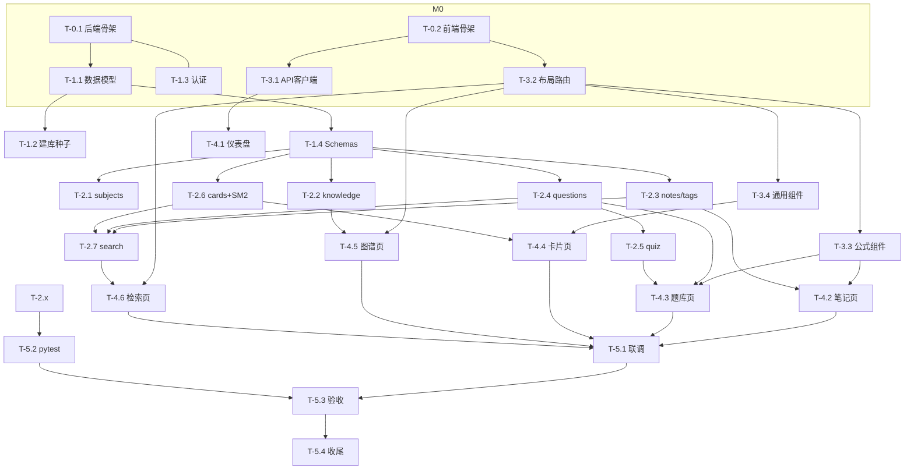

# 06 · 任务分解（依赖图与执行顺序）

> 版本：v1.0 ｜ 更新：2024-XX-XX ｜ 作者：学生（AI 协作）
> 上游：01~05；下游：07 测试、实现执行
> 说明：每个任务带 ID、里程碑、**前置依赖**、交付物与自验收标准。执行时**只能在前置任务完成后开始**。

---

## 1. 里程碑总览

| 里程碑 | 目标 | 完成标志 | 实现状态 |
| --- | --- | --- | --- |
| M0 | 项目与骨架 | 前后端可启动、路由/目录就绪 | ✅ |
| M1 | 数据层与基础设施 | 数据模型/认证/Schema 就绪 | ✅ |
| M2 | 后端核心 API | 五大功能接口可用（pytest 通过） | ✅ 13 用例通过 |
| M3 | 前端基础设施 | 布局/路由/公式组件/API 客户端就绪 | ✅ |
| M4 | 前端功能页面 | 五大功能页面可用（对接真实接口） | ✅ 已构建并联调 |
| M5 | 集成与验收 | 端到端可用，验收标准（文档 07）满足 | ✅ 端到端验证 |

## 2. 任务清单

### M0 · 项目与骨架

| ID | 任务 | 前置 | 交付物 |
| --- | --- | --- | --- |
| T-0.1 | 初始化后端（requirements/config/main/db 引擎） | 文档03 | 可 `uvicorn` 启动，`GET /health` 返回正常 |
| T-0.2 | 初始化前端（Vite+Vue3+TS+Router+Pinia+axios+KaTeX） | 文档03/05 | 可 `npm run dev` 打开壳页面 |
| T-0.3 | 建 `.gitignore` 与统一环境变量示例 `.env.example` | 文档03 | 仓库整洁、配置项有文档 |

### M1 · 数据层与基础设施

| ID | 任务 | 前置 | 交付物 |
| --- | --- | --- | --- |
| T-1.1 | SQLAlchemy 数据模型（全部实体） | T-0.1, 文档02 | `models/` 可被导入，create_all 建表 |
| T-1.2 | 数据库初始化 + 种子（学科预置 + 少量示例数据） | T-1.1, 文档02 | 启动自动建库并预置数学分析/高等代数 |
| T-1.3 | 认证模块（token 签发/校验） | T-0.1, 文档04 | `auth.py` 校验逻辑 + `POST /api/auth/login` |
| T-1.4 | Pydantic Schemas（所有请求/响应契约） | T-1.1, 文档04 | `schemas/` 与文档 04 一致 |

### M2 · 后端核心 API（依赖 T-1.1/T-1.4）

| ID | 任务 | 前置 | 交付物 |
| --- | --- | --- | --- |
| T-2.1 | subjects API | T-1.4 | 学科增删查 |
| T-2.2 | knowledge API（含 graph/relations/related） | T-1.4 | 知识点 CRUD + 图谱/关联 |
| T-2.3 | notes + tags API | T-1.4 | 笔记 CRUD + 标签 + 过滤 |
| T-2.4 | questions API | T-1.4 | 题目 CRUD + 筛选 |
| T-2.5 | quiz API（组卷/判分/错题本） | T-2.4 | 会话创建/作答/统计/错题 |
| T-2.6 | cards API + SM-2 服务 | T-1.4 | 卡片 CRUD + 复习队列 + 评分调度 |
| T-2.7 | search API（FTS5）+ FTS 同步 | T-2.3/T-2.4/T-2.6 | 跨类型全文检索 |

> 说明：T-2.1~T-2.4 之间无相互依赖，可并行；T-2.5 依赖 T-2.4；T-2.6 依赖 T-1.4；T-2.7 依赖多个内容 API。

### M3 · 前端基础设施（可与 M2 部分并行）

| ID | 任务 | 前置 | 交付物 |
| --- | --- | --- | --- |
| T-3.1 | API 客户端 + auth store + axios 拦截器 | T-0.2, 文档04 | `client.ts`、`useAuthStore`、401 处理 |
| T-3.2 | 布局 + 路由表 + 应用壳 | T-0.2, 文档05 | 侧边栏导航 + 各路由占位 |
| T-3.3 | MarkdownRenderer + KaTeX 组件 | T-0.2, 文档05 | 富文本/公式渲染组件 |
| T-3.4 | 通用组件（SubjectSelect/TagInput/KnowledgePicker/QuestionCard/Flashcard） | T-3.2 | 组件库 |

### M4 · 前端功能页面（依赖 T-3.x，对接 T-2.x 接口）

| ID | 任务 | 前置 | 交付物 |
| --- | --- | --- | --- |
| T-4.1 | 仪表盘（Dashboard）+ 学科/登录入口 | T-3.1, T-2.1 | 首页可用 |
| T-4.2 | 笔记页面（列表/编辑/详情） | T-3.2, T-3.3, T-2.3 | 笔记增删改查、公式渲染、搜索 |
| T-4.3 | 题库与刷题（列表/组卷/作答/错题本） | T-3.2, T-2.4, T-2.5 | 刷题全流程 |
| T-4.4 | 卡片与复习（列表/今日复习/翻转打分） | T-3.2, T-3.4, T-2.6 | 间隔重复全流程 |
| T-4.5 | 知识点图谱（列表/图可视化/关联） | T-3.2, T-2.2 | 图谱可交互 |
| T-4.6 | 检索页 | T-3.2, T-2.7 | 跨类型检索与跳转 |

### M5 · 集成与验收（依赖 M2 + M4 全部）

| ID | 任务 | 前置 | 交付物 |
| --- | --- | --- | --- |
| T-5.1 | 前后端联调（Vite proxy，跨设备可选） | T-4.1~4.6 | 端到端可用 |
| T-5.2 | 后端 pytest 用例（关键路径） | T-2.x | 测试通过 |
| T-5.3 | 手工验收（对照文档 07 清单） | T-5.1, T-5.2 | 验收通过记录 |
| T-5.4 | 收尾（README 运行说明、文档同步、种子数据完善） | T-5.3 | 可交付文档 |

## 3. 依赖图（Mermaid）

## 4. 执行策略建议

1. **M0 + M1 + M2** 后端优先：`T-1.1 → T-1.4 → T-2.x`，期间可并行起前端骨架与通用组件（`T-3.x`）。
2. **T-2.1~T-2.4 可并行**（无相互依赖），适合批量实现。
3. **M4** 页面按 `笔记 → 题库 → 卡片 → 图谱 → 检索` 顺序推进，每完成一个就用真实接口自测。
4. **M5** 收尾：跑测试、手工验收、补文档。

## 5. 风险与对策

| 风险 | 对策 |
| --- | --- |
| FTS5 依赖版本/平台 | 检索失败时降级为 SQL `LIKE` 搜索，不影响主功能 |
| 图谱可视化依赖较重 | 初版可用 `force-graph`；若体积/兼容问题则降级为树路由 + 列表 |
| SM-2 参数调优 | 采用标准 SM-2 参数；学生可按反馈微调，不改数据结构 |
| 跨设备访问安全 | 提供 Bearer token + 反向代理/HTTPS 说明，不作为 P0 |
